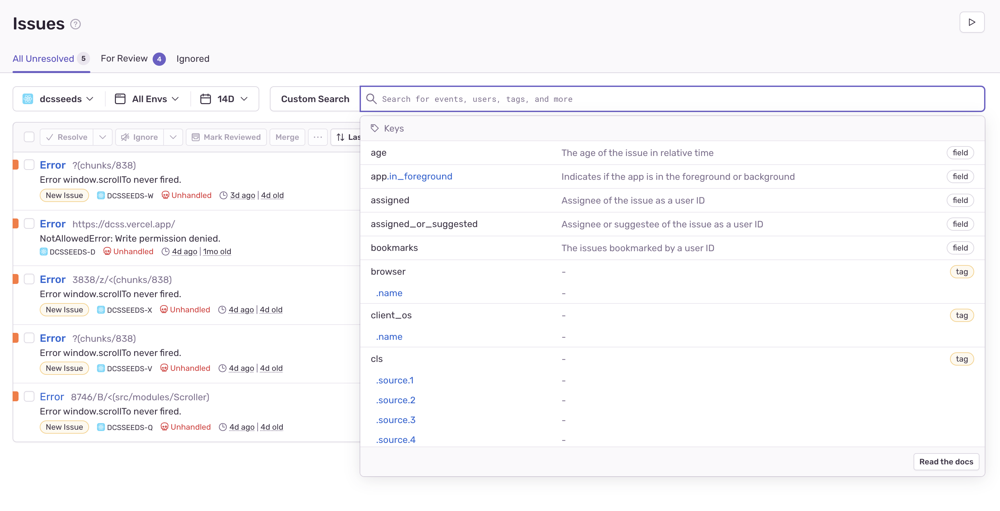
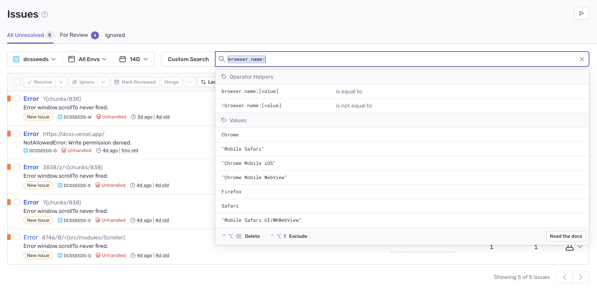

# item search

open ended item search needs more structure, right now it's a very simple text match
but doesn't support using AND/OR to combine clauses, we should come up with a better strategy
for example it'd be much better if we could filter items by

  - type (e.g. shield, axe, staff, body, feet, barding, ring, etc.)
  - brand (e.g. drain, venom, flame, pain, vorpal, vamp, etc.)
  - property (e.g. Slay, Int, Str, rElec, rF, Contam, *Corrode, Drain etc.)

imagine queries such as
  (amulet reflect)       -- amulet with reflect
  (body ac)              -- body armor with any amount of ac
  (head will+ ac+4)      -- head with exactly Will+ and AC+4
  (axe vamp slay>2)      -- axe with at least slay+2 and vamp brand
  (ring !int<0 str>4)    -- ring with at least str+4 and no negative int
  (gold<1000)            -- any item with a cost less then 1000 (including free)


See [events-refactor](docs/events-refactor.md) which has outline for properties and parsing them out
of item name, this would be requisite for this work so we could create a document for each item


## displaying results

for all approaches when displaying results we will want to re-group them into a seed version object
this should be a simple iteration to recreate the shape we use for artifact filters
it will also allow us to reuse all of the rendering logic we have for artifacts which is nice
this is very similar to what we do in useArtifactFilter as well when we build local results

```js
const result_map = new Map();

// record_list is the array of search results which is a flat json object
for (const result of record_list) {
  const { seed, version, name, branch, level } = result;
  const seed_key = seed_version_key(seed, version);

  const seed_result = result_map.get(seed_key) || {
    seed,
    version,
    // empty because each unique result will be present in item_list
    // all_item_list is used by artifact search to show other artifacts
    all_item_list: [],
    item_list: [],
  };

  seed_result.item_list.push({ name, branch, level });

  result_map.set(seed_key, seed_result);
}
```

## approaches

### graphql regexes

it is fast enough, can bulid a proof of concept like this
for fun we could explore trying out elasticsearch but maybe overkill for our purposes
at least for now regex seems fast enough and avoids setting up more services/tasks

### search record table

we can upload the records at the same time we mutation items into database
inside `addMorgue` we can create and make the calls to write the records
alternatively we could write some periodic task (cron event in the database, github action, etc.)
that queried database for the data, builds records and saves them

use the property splitter from [events-refactor](docs/events-refactor.md)
the query below can be used to gather data which we would store in our record
we will need to split all the items into json record to store in search index

store results in a table on graphql, query that table using where clauses
little more direct, avoids regex converting in favor of more readable where clauses?

```graphql
  { property_list: { property: { name: { _eq: "plus" } value: { _gt: 4 } } } }
  { property_list: { property: { type: { _eq: "brand" } name: { _eq: "vamp" } } } }
```


## using elasticsearch records to search all items

same as above, we upload the records but instead to the elasticsearch provider (see options below)
use the property splitter from [events-refactor](docs/events-refactor.md)

must be flat because arrays are not easy to combine boolean queries in elasticsearch since
records are filtered at the top level if any filter matches a property
e.g.  `plus > 6 AND EV > 3` would return both records below, but you might expect only the first
      this is because the top record matches the first boolean and the bottom matches the second

you can nest fields and query them but it is a little more complicated
keeping it flat seems good for our case since we don't require many fields just a name and value
https://opensearch.org/docs/1.3/opensearch/supported-field-types/nested/

```json
[
  {
    "id": "1234",
    "name": "+13 crystal plate armour of the Devil's Team {rPois rC+ rN+++ Dex-5}",
    "seed": "1234567890",
    "version": "0.29.1",
    "branch": "Dungeon",
    "branch_order": -99,
    "level": 13,
    "plus": 13,
    "rPois": 1,
    "rC": 1,
    "rN": 3,
    "Dex": -5,
  },
  {
    "id": "5678",
    "name": "+7 Spriggan's Knife {stab, EV+4 Stlth+}",
    "seed": "1234567890",
    "version": "0.29.1",
    "branch": "Lair",
    "level": 3,
    "branch_order": -80,
    "stab": true,
    "plus": 7,
    "EV": 4,
    "Stlth": 1,
  },
]
```


```graphql
query ItemRecordDemo {
  dcsseeds_scrapePlayers_seedVersion_aggregate {
    aggregate {
      count(columns: [seed, version])
    }
  }

  dcsseeds_scrapePlayers_seedVersion(limit: 1) {
    seed
    version
    items {
      name
      branch {
        name
        order
      }
      level
    }
  }
}
```

### providers

#### Algolia

seems easy to use but pricey and free tier only stores 10k records
just `0.29.1` items are currently over 10k entries so we wouldn't be able to store everything

> https://www.algolia.com/doc/

the demo is pretty compelling, very fast, shows facets (pivots for filtering etc.)
if we uploaded items maybe we would get some interesting results and pivots etc.

the React hooks look good too, seems like a very well written library

> https://www.algolia.com/doc/guides/building-search-ui/what-is-instantsearch/react-hooks/


#### opensearch
free tier on aws could probably get us far for now
https://opensearch.org/docs
the docs are pretty good, shows some examples like range queries etc which
we would use to implement above
https://opensearch.org/docs/2.4/opensearch/query-dsl/term/#range


#### regex clauses in graphql
translate input into series of regex clauses for query
we can get really close using regex where clauses, see below
only support `>` (not `>=` for simplicity)
  why? `>` and `>=` communicate the same thing
  `plus >  6`  `min_plus = 7 = 6 + 1`
  `plus >= 7`  `min_plus = 7`


```graphql
query {
  dcsseeds_scrapePlayers_item(
    order_by: [{ branch: { order: asc } }, { level: asc }]
    where: {
      _or: [
        # (plus > 6 AND slay > 5) OR (rN > 2 AND Will > 2 AND !Contam)
        {
          _and: [
            # plus > 6 AND slay > 5
            { name: { _iregex: "^\\+([7-9]|\\d{2,})" } }
            { name: { _iregex: "Slay\\+([6-9]|\\d{2,})" } }
            # { name: { _nregex: "\\-Tele" } }
            # brand
            # { name: { _iregex: "{vamp" } }
          ]
        }
        {
          _and: [
            # rN > 2 AND Will > 2 AND !Contam
            { name: { _iregex: "rN[\\+]{3,}" } }
            { name: { _iregex: "Will[\\+]{3,}" } }
            { name: { _nregex: "Contam" } }
            # { name: { _nregex: "\\-Cast" } }
          ]
        }
      ]
    }
  ) {
    version
    seed
    name
    branchName
    level
  }
}
```

#### typesense
https://github.com/dokku/dokku-typesense
https://typesense.org/docs/guide/install-typesense.html#option-1-typesense-cloud


## inspo

### Senry

has a pretty nice search UI, I like how the pills help you build your query

> https://dcss.sentry.io/issues/?project=5403737

> 
> 
